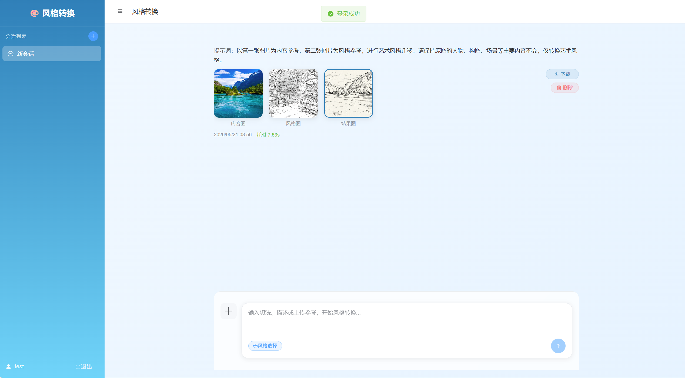
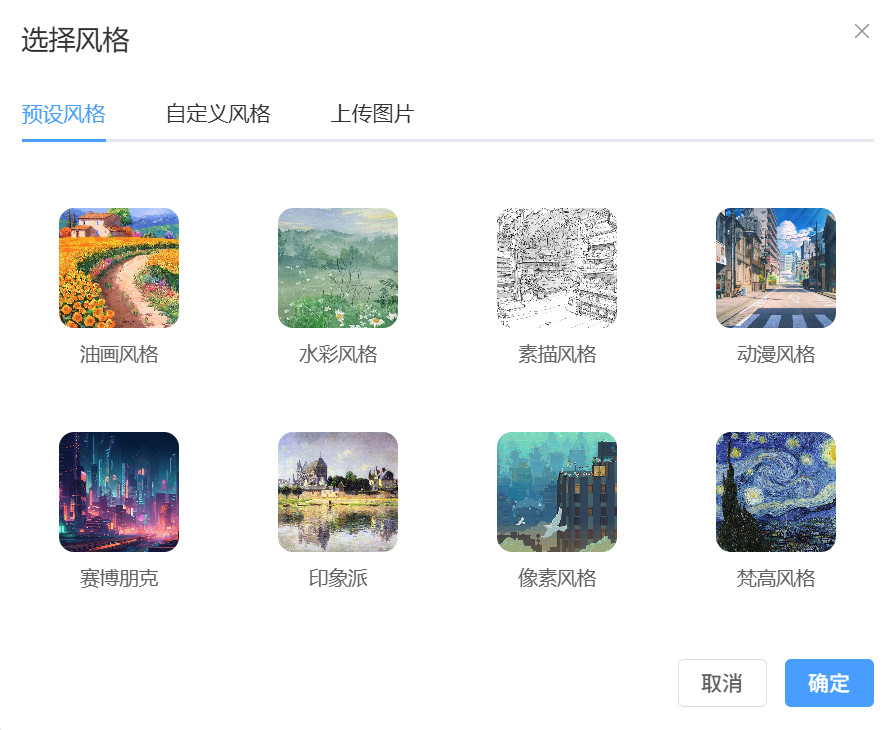

# 图片风格转换系统

基于 AI 的图片艺术风格转换平台，支持将任意图片转换为指定的艺术风格。

## 项目截图

### 登录页面


### 会话页面



### 风格选择



## 功能特性

### 核心功能

- **风格转换**：上传内容图片，选择风格图片，一键生成艺术风格转换结果
- **预设风格**：内置 8 种预设艺术风格（油画、水彩、素描、动漫、赛博朋克、印象派、像素、梵高）
- **自定义风格**：用户可上传自己的风格图片，创建个性化风格库
- **提示词增强**：支持自定义转换提示词，精细控制转换效果

### 用户系统

- 用户注册与登录
- JWT Token 鉴权
- Redis Token 缓存管理
- 多用户数据隔离

### 会话管理

- 多会话支持，按会话隔离历史记录
- 会话创建、重命名、删除
- 历史记录查看与删除

### 技术特性

- 前后端分离架构
- Docker 容器化部署
- MySQL 数据持久化
- Redis 缓存支持
- Nginx 反向代理

## 示例效果

### 原图与转换结果对比

#### 示例 1

| 原图                                                        | 转换结果                                                    |
| ----------------------------------------------------------- | ----------------------------------------------------------- |
|  |  |

#### 示例 2

| 原图                                                        | 转换结果                                                    |
| ----------------------------------------------------------- | ----------------------------------------------------------- |
|  |  |

#### 示例 3

| 原图                                                        | 转换结果                                                    |
| ----------------------------------------------------------- | ----------------------------------------------------------- |
|  |  |

## 技术栈

### 前端

- Vue 3 + Vite
- Element Plus UI 组件库
- Pinia 状态管理
- Vue Router 路由
- Axios HTTP 客户端

### 后端

- Python 3.13
- FastAPI Web 框架
- SQLModel ORM
- MySQL 8.0 数据库
- Redis 7 缓存
- PyJWT 认证
- HTTPX 异步 HTTP 客户端

### AI 服务

- 阿里云 DashScope API（通义千问图像生成模型）

## 项目结构

```
Image-frame-conversion/
├── backend/                    # 后端服务
│   ├── app/
│   │   ├── models/            # 数据模型
│   │   ├── routers/           # API 路由
│   │   ├── schemas/           # Pydantic 模式
│   │   ├── services/          # 业务逻辑
│   │   ├── utils/             # 工具函数
│   │   ├── config.py          # 配置管理
│   │   ├── database.py        # 数据库连接
│   │   └── main.py            # 应用入口
│   ├── presets/               # 预设风格图片
│   ├── Dockerfile
│   └── pyproject.toml
├── frontend/                   # 前端服务
│   ├── src/
│   │   ├── api/               # API 请求
│   │   ├── layout/            # 布局组件
│   │   ├── router/            # 路由配置
│   │   ├── stores/            # 状态管理
│   │   ├── views/             # 页面组件
│   │   └── main.js            # 应用入口
│   ├── nginx.conf             # Nginx 配置
│   ├── Dockerfile
│   └── package.json
├── docker-compose.yml         # Docker Compose 配置
├── .env.example               # 环境变量示例
└── README.md
```

## Docker 部署

### 前置要求

- Docker 20.10+
- Docker Compose 2.0+
- 阿里云 DashScope API Key

### 快速部署

1. **克隆项目**

   ```bash
   git clone git@github.com:Atwill-11/Image-frame-conversion.git
   cd Image-frame-conversion
   ```

2. **配置环境变量**

   ```bash
   # 复制环境变量模板
   cp .env.example .env

   # 编辑 .env 文件，填入你的 DashScope API Key
   # DASHSCOPE_API_KEY=<your_api_key_here>
   ```

3. **启动服务**

   ```bash
   docker compose up -d
   ```

4. **访问应用**
   - 前端：http://localhost:2500
   - 后端 API：http://localhost:2800
   - API 文档：http://localhost:2800/docs

### 服务端口

| 服务           | 容器端口 | 宿主机端口 |
| -------------- | -------- | ---------- |
| 前端 (Nginx)   | 80       | 2500       |
| 后端 (FastAPI) | 8000     | 2800       |
| MySQL          | 3306     | 3307       |
| Redis          | 6379     | 6379       |

### 环境变量说明

| 变量名              | 说明                     | 默认值                   |
| ------------------- | ------------------------ | ------------------------ |
| `DASHSCOPE_API_KEY` | 阿里云 DashScope API Key | -                        |
| `MYSQL_PASSWORD`    | MySQL root 密码          | `mysql_root_2024`        |
| `MYSQL_DATABASE`    | 数据库名称               | `image_style_conversion` |
| `SECRET_KEY`        | JWT 密钥                 | -                        |

### 常用命令

```bash
# 启动所有服务
docker compose up -d

# 查看服务状态
docker compose ps

# 查看日志
docker compose logs -f backend
docker compose logs -f frontend

# 重新构建镜像
docker compose build --no-cache

# 重新构建并启动单个服务
docker compose build --no-cache frontend
docker compose up -d frontend

# 停止所有服务
docker compose down

# 停止并删除数据卷
docker compose down -v
```

## API 接口

### 认证接口

- `POST /api/auth/register` - 用户注册
- `POST /api/auth/login` - 用户登录
- `POST /api/auth/logout` - 用户登出
- `GET /api/auth/me` - 获取当前用户信息

### 会话接口

- `POST /api/sessions/` - 创建会话
- `GET /api/sessions/` - 获取用户所有会话
- `GET /api/sessions/{id}` - 获取会话详情
- `PUT /api/sessions/{id}` - 更新会话
- `DELETE /api/sessions/{id}` - 删除会话

### 风格接口

- `GET /api/styles/presets` - 获取预设风格列表
- `GET /api/styles/custom` - 获取用户自定义风格列表
- `POST /api/styles/custom` - 创建自定义风格
- `DELETE /api/styles/custom/{id}` - 删除自定义风格

### 转换接口

- `POST /api/style/convert` - 执行风格转换
- `GET /api/style/history/{session_id}` - 获取会话历史记录
- `DELETE /api/style/history/{record_id}` - 删除历史记录

## 预设风格

| 风格 ID         | 名称     | 描述             |
| --------------- | -------- | ---------------- |
| `oil_painting`  | 油画风格 | 经典油画艺术风格 |
| `watercolor`    | 水彩风格 | 清新水彩画风格   |
| `sketch`        | 素描风格 | 铅笔素描风格     |
| `anime`         | 动漫风格 | 日系动漫风格     |
| `cyberpunk`     | 赛博朋克 | 未来科技风格     |
| `impressionist` | 印象派   | 印象派艺术风格   |
| `pixel_art`     | 像素风格 | 复古像素艺术     |
| `vangogh`       | 梵高风格 | 梵高星空风格     |
